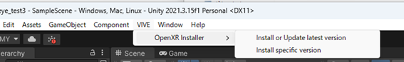
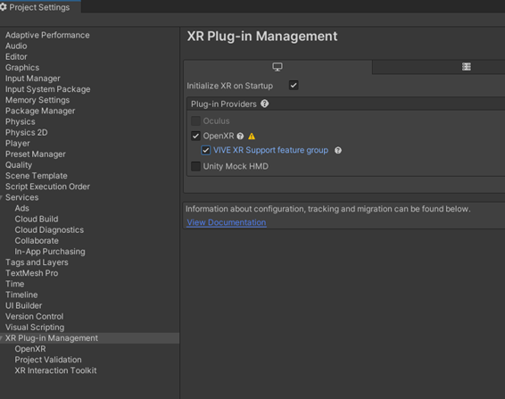
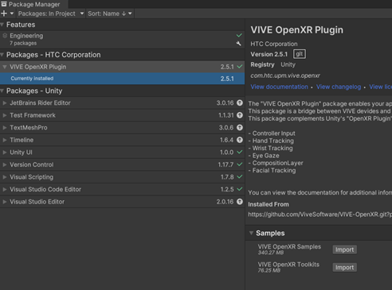
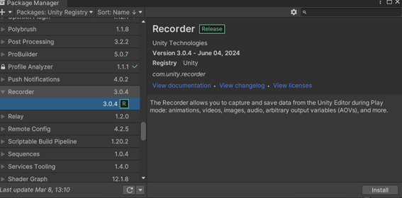

# eye_tracking_htc_vive
eye tracking sample for htc vive pro eye, unity package

----

T-key: Information is displayed 

F-key: Information is not displayed (only 'Recording')

This tool outputs mp4 and text files.

----

Please import (1)VIVE Open XR Plugin (need Git command) (2) Recorder.

Download ViveOpenXRInstaller.unitypackage

(Git commands will run in the background)

Recorder

